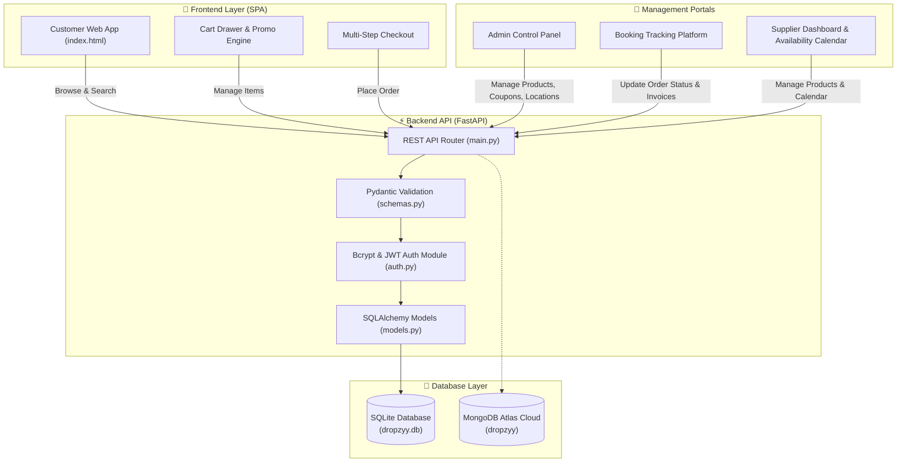

# 🛒 Dropzyy 1 — System Flow, Architecture & Admin Management Manual

Welcome to **Dropzyy 1** (Apni Digital Kirana Dukan). This document provides a complete overview of the project flow, technical architecture, and a step-by-step manual on how to manage all administrative features.

---

## 🖼️ 1. Project Workflow & Architecture Diagram

### 📊 System Workflow Overview


---

## 🔑 2. Pre-Configured Test Credentials

| Role | Username | Password | Privileges |
| :--- | :--- | :--- | :--- |
| **System Admin** | `yashpatil` | `12528289Yash@` | Full access to Admin Panel, Products, Suppliers, Orders, Coupons, Locations |
| **Admin** | `admin` | `Dropzyy@Admin#2026!` (or `admin123`) | Full admin privileges & Order Tracking |
| **Supplier** | `supplier` | `Supplier@Dropzyy#2026!` (or `supplier123`) | Supplier Dashboard, Product Creation, Availability Calendar & Store Timings |

---

## 🛠️ 3. Step-by-Step Admin Management Guide

### A. Managing Products & Inventory
1. Log in using `yashpatil` or `admin`.
2. Click **Admin Panel** in the top control bar.
3. **Add New Item**:
   - Fill in Title (e.g. *Fortune Sunlite Sunflower Oil*).
   - Select Category (*staples*, *oil*, *dairy*, *vegetables*, *tea*, *snacks*).
   - Enter Price and Original Price (discount badge is auto-calculated).
   - Provide image URL, unit (e.g. *1 Litre Pouch*), and description.
   - Click **Save Product**.
4. **Edit / Delete Item**:
   - Locate the item on the store grid and click the **Pencil Icon** to edit or **Trash Icon** to delete.

### B. Managing Discount Coupons
1. Open **Admin Panel** -> **Manage Discount Coupons**.
2. **Create Coupon**:
   - Enter Code (e.g. `FRESH10`).
   - Enter Discount Percentage (e.g. `10`).
   - Set Minimum Order amount (e.g. `250`).
   - Select Target Audience (*Everyone* or *Specific User*).
3. Click **Create Coupon**. Active coupons take effect immediately during checkout.

### C. Managing Serviceable Cities & Pincodes
1. Open **Admin Panel** -> **Manage Serviceable Pincodes**.
2. **Add Location**:
   - Enter Area/City Name (e.g. *Savda* or *Mumbai*).
   - Enter 6-digit Pincode (e.g. *425502* or *400001*).
3. Locations auto-populate on checkout. Delivery requests to non-configured pincodes are blocked.

### D. Order Tracking & Status Updates
1. Click **Track Bookings** in the management toolbar.
2. Search by **Order ID**, **Customer Name**, or **Phone Number**.
3. Change order status via dropdown:
   - `Placed` ➔ `Packing` ➔ `Shipped` ➔ `Delivered` (or `Cancelled`).
4. Click the **PDF Icon** to open and print an official tax invoice.

---

## 🚀 4. How to Run Locally

```bash
# 1. Start the FastAPI server
uvicorn main:app --reload --port 8000

# 2. Open in web browser
http://localhost:8000
```
